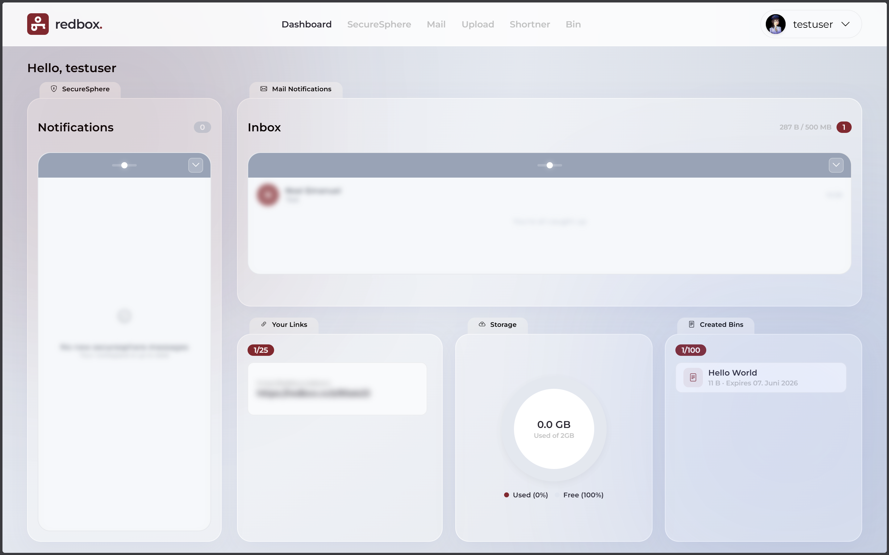
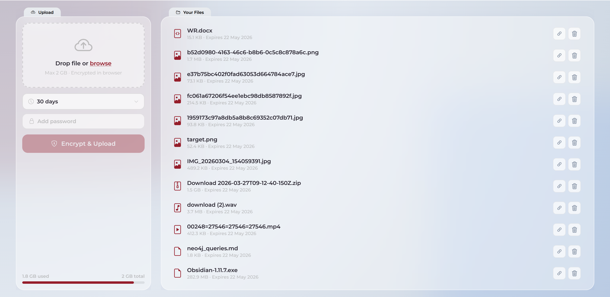
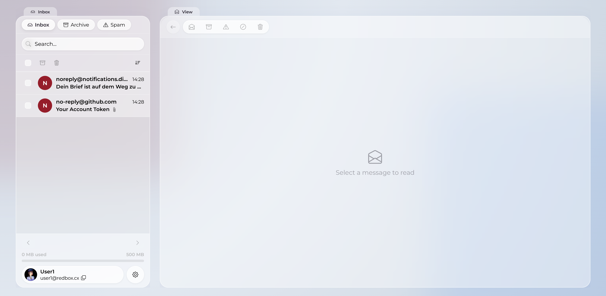
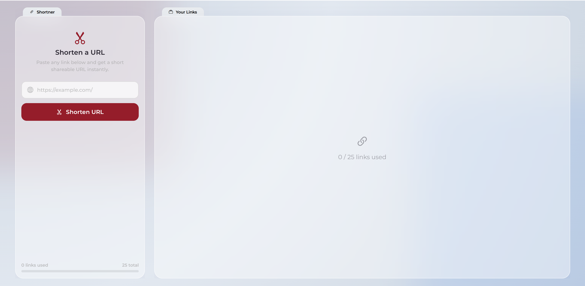
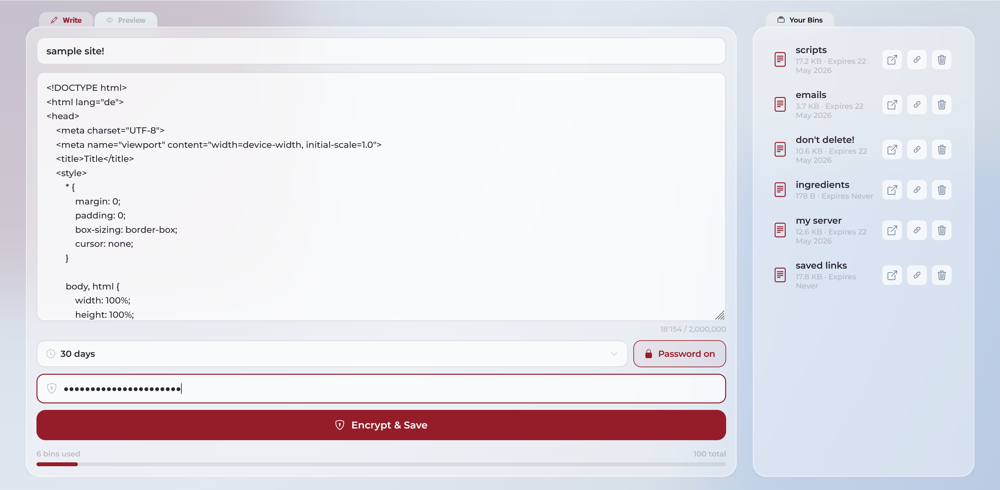

<p align="center">
  
</p>

<h1 align="center">redbox</h1>

<p align="center">
  Privacy-focused self-hosted platform for encrypted sharing, mail and administration.
</p>

redbox is a privacy-focused, self-hosted web platform for invite-only users. It combines a React single-page application with a NestJS API and provides encrypted file sharing, encrypted text bins, a URL shortener, a read-only mail inbox, public blog pages, reports, notifications, and an admin API.

The project is built around data minimization and operational control: users register with invite codes, passwords are hashed, files and bins are encrypted before sharing, mail bodies are stored in object storage, and the backend keeps only the metadata it needs to operate the platform.

<p align="center">
  
</p>

## Contents

- [Project Structure](#project-structure)
- [Features](#features)
- [Architecture](#architecture)
- [Technology Stack](#technology-stack)
- [Requirements](#requirements)
- [Local Setup](#local-setup)
- [Database and Seed](#database-and-seed)
- [Object Storage](#object-storage)
- [API Overview](#api-overview)
- [Security Notes](#security-notes)
- [Documentation](#documentation)
- [Screenshots](#screenshots)

## Project Structure

```text
.
+-- apps/
|   +-- backend/        # NestJS API, Prisma schema, migrations, admin API
|   +-- frontend/       # React + TypeScript + Vite frontend
+-- docs/               # Project, concept, implementation and final reports
+-- docker-compose.yaml # Local infrastructure: MariaDB, Redis, MinIO
+-- README.md
```

## Features

| Feature | Description |
|---|---|
| Encrypted Files | AES-GCM encrypted uploads with share links |
| Encrypted Bins | Secure text sharing with expiry support |
| URL Shortener | Public redirect endpoint |
| Mail Inbox | Read-only incoming mail interface |
| Notifications | Real-time SSE updates |
| Admin API | Moderation and administration |

## Architecture

redbox is split into a frontend application, a main backend API, a separate admin backend entry point and supporting infrastructure.

```text
Browser
  |
  | React SPA
  v
Frontend (Vite, port 5173)
  |
  | REST / JSON / multipart / SSE
  v
Main Backend (NestJS, port 3000)
  |-- MariaDB via Prisma
  |-- Redis for sessions, upload state and rate limits
  |-- MinIO/S3 for files, mails, blog content and report attachments
  |
  +-- Admin Backend entry point (NestJS, port 3001)
```

The admin frontend is maintained in a separate repository. This repository contains the main user-facing frontend, the main backend API and the admin backend API.

## Technology Stack

### Backend

- Node.js + TypeScript
- NestJS
- Prisma ORM
- MariaDB
- Redis via `@nestjs-modules/ioredis`
- MinIO / S3 via AWS SDK
- JWT authentication with Passport
- bcrypt / bcryptjs
- Nest Scheduler for cleanup jobs

### Frontend

- React 19
- TypeScript
- Vite / rolldown-vite
- React Router
- Axios
- Web Crypto API
- Motion
- Bootstrap Icons
- Marked

### Infrastructure

- Docker Compose
- MariaDB 11
- Redis 7
- MinIO
- Cloudflare Email Routing for incoming mail

## Requirements

- Node.js
- pnpm
- Docker and Docker Compose
- Manually created MinIO buckets

## Local Setup

Start the infrastructure from the repository root:

```bash
docker-compose up -d
```

Install and start the backend:

```bash
cd apps/backend
pnpm install
cp .env.example .env
pnpm exec prisma migrate dev
pnpm run start:dev
```

Install and start the frontend:

```bash
cd apps/frontend
pnpm install
cp .env.example .env
pnpm run dev
```

Default local ports:

| Service | URL |
| --- | --- |
| Frontend | `http://localhost:5173` |
| Main backend | `http://localhost:3000/api/v1` |
| Admin backend | `http://localhost:3001/api/v1` |
| MariaDB | `localhost:3306` |
| Redis | `localhost:6379` |
| MinIO API | `http://localhost:9000` |
| MinIO console | `http://localhost:9001` |


## Database and Seed

The Prisma schema is located at `apps/backend/prisma/schema.prisma`. Migrations are stored in `apps/backend/prisma/migrations`.

Run migrations from `apps/backend`:

```bash
pnpm exec prisma migrate dev
```

Seed data is defined in `apps/backend/prisma/seed.ts`. It creates the `testcode` invite code and, when `ADMIN_SEED_USERNAME` and `ADMIN_SEED_PASSWORD` are present, an admin user.

Run the seed from the Prisma directory:

```bash
cd apps/backend/prisma
pnpx run seed.ts
```

## Object Storage

redbox uses MinIO through the S3 API. Buckets are created manually.

Create the buckets configured in `apps/backend/.env`:

- `redbox-files`
- `redbox-mails`
- `redbox-blogs`

For local development with the provided Compose file, the MinIO console is available at:

```text
http://localhost:9001
```

## API Overview

All main API routes are prefixed with:

```text
/api/v1
```

Main backend modules:

| Area | Routes |
| --- | --- |
| Auth | `/auth/login`, `/auth/register`, `/auth/refresh`, `/auth/logout`, `/auth/password`, `/auth/recover-password`, `/auth/account/reactivate` |
| User | `/user/profile`, `/user/avatar`, `/user/invites`, `/user/account/delete-request` |
| Files | `/files`, `/files/init`, `/files/upload/:uploadId`, `/files/complete`, `/files/download/:id` |
| Bins | `/bins`, `/bins/:id/:token` |
| Links | `/links`, `/links/redirect/:code` |
| Mail | `/mail`, `/mail/events`, `/mail/incoming`, `/mail/:id`, `/mail/:mailId/attachment/:attachmentId` |
| Blog | `/blog`, `/blog/:postId` |
| Reports | `/reports/content`, `/reports/bugs` |
| Notifications | `/notifications`, `/notifications/events` |

Admin routes are served by the admin backend entry point and are prefixed with:

```text
/api/v1/admin
```

Admin areas include authentication, dashboard metrics, user management, invite codes, reports, internal mails, blog management, logs, notifications, audit logs and route controls.

## Security Notes

- Registration is restricted through invite codes.
- Passwords and recovery phrases are hashed before storage.
- JWTs contain a session key so sessions can be invalidated globally.
- User master keys are encrypted at rest and cached temporarily in Redis during active sessions.
- Files are encrypted in the browser with AES-GCM before upload.
- File and bin share links keep the decryption key in the URL fragment, so the key is not sent to the server as part of the HTTP request.
- Optional passwords for shared files and bins are verified server-side through bcrypt hashes.
- Incoming mail is accepted only with the configured webhook secret.
- Mail bodies and attachments are stored in MinIO and encrypted per mail.
- Redis-backed rate limiting is applied to authentication, upload, download, mail, report and admin routes.
- Expired files and bins are removed by scheduled cleanup jobs.
- Admin and report workflows can intentionally access or act on reported content. This is part of the moderation design and should be reflected in user-facing policies.

## Documentation

Additional project documentation is stored in `docs/`:

- `docs/projekt_redbox.md`
- `docs/studie1_1.md`
- `docs/2_1_Konzeptbericht_redbox_v2.md`
- `docs/3_1_Realisierungsbericht_redbox.md`
- `docs/5_1_Schlussbericht_redbox.md`

## Screenshots
### Dashboard



### File Sharing



### Mail Inbox



### URL Shortner



### Pastebin

